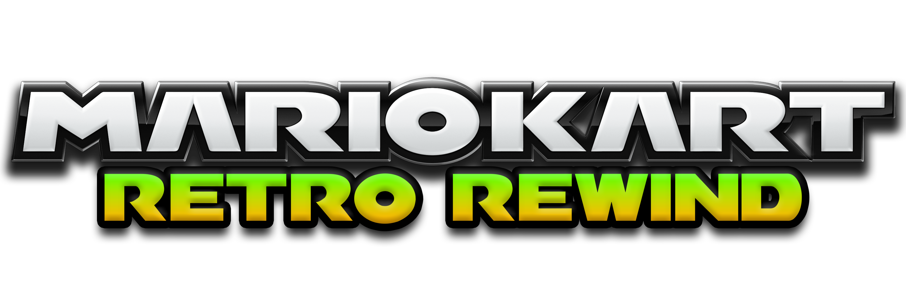

   
  
  <h2>🏎️ Retro Rewind
   Web App</h2>

A simple web app that displays the current online rooms for **Retro Rewind**, a Custom Track-Distribution for Mario Kart Wii.

**App available at: [https://rr.heyfordy.de](https://rr.heyfordy.de)**

## 🚀 Features

* Live view of all public and private online rooms.
* Detailed view per room: players, VR/BR points, host, uptime.
* **Player Reporting System:** Integrated Discord Webhook reporting for moderation.
* **Mii Rendering:** Automatic conversion of raw Mii data to Nintendo Studio images (via RC24).
* Visit player Discord profiles.
* Local Favorites system + Player search (by Name/FC),
* Mobile and desktop-optimized layout with various themes.
* "Add to Home Screen" functionality for iOS and Android.
* History mode (7d max.)

## ⚙️ APIs Used (Worker Upstreams)

* **Room Data** | [http://rwfc.net/api/groups](http://rwfc.net/api/groups)
* **Profile stats** | [https://rwfc.net/vr](https://rwfc.net/vr)
* **RC24 Mii Rendering** | [WiiLink/Riiconnect24 Mii Studio](https://miicontestp.wii.rc24.xyz/cgi-bin/studio.cgi)
* **Report Discord Webhook** | [Weebo64's Homepage (./rooms)](https://github.com/Weebo6464/homepage/tree/main/rooms)

## 🤝 Credits

* **Project Repository:** [Bitte-ein-Git/rr_app](https://github.com/Bitte-ein-Git/rr_app)
* **Retro Rewind:** [Retro-Rewind-Team/rr-pulsar](https://github.com/Retro-Rewind-Team/rr-pulsar)
* **WheelWizard:** [patchzyy](https://github.com/patchzyy/WheelWizard)
* **Fonts:** [CTMKF](https://wiki.tockdom.com/wiki/CTMKF) & [Rubik](https://www.fontsquirrel.com/fonts/rubik)
* **Report Discord Webhook:** [Weebo64](https://github.com/Weebo6464)

## 📜 License & Usage

This project is licensed under the [MIT](./LICENSE) License.

Copyright © 2025 [rr.heyfordy.de](https://rr.heyfordy.de)

If you use or adapt this code for your own projects, please provide attribution by linking back to the original repository or website.